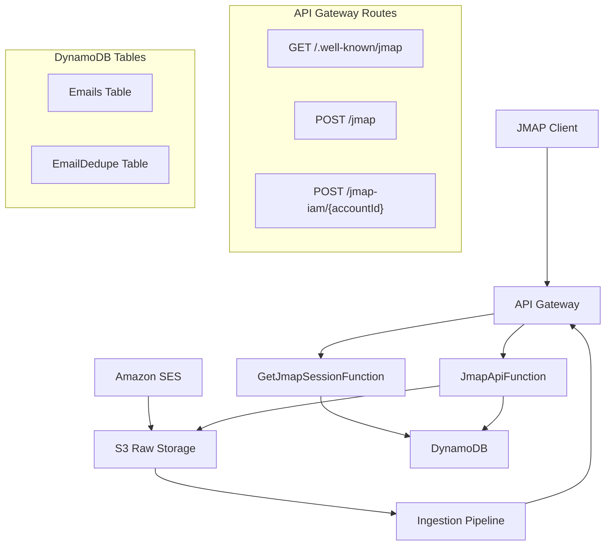

# Design Document: Minimal JMAP Server

## Overview

This design implements a minimal JMAP (JSON Meta Application Protocol) email server that provides server-side email ingestion, storage, and retrieval capabilities. The system supports two authentication modes:

- **User authentication** via Cognito JWT for client applications accessing the `/jmap` endpoint
- **Machine authentication** via AWS IAM SigV4 for automated email ingestion via the `/jmap-iam/{accountId}` endpoint

The implementation deliberately excludes advanced JMAP features like threads, mail submission, mailbox CRUD, full-text search, and push notifications to maintain MVP simplicity while providing a solid foundation for future expansion.

## Architecture

The system follows a serverless architecture on AWS with these key components:



### Authentication Flow

**User Flow (Cognito JWT):**
1. Client obtains Cognito JWT token
2. Client calls `/.well-known/jmap` or `/jmap` with Authorization header
3. API Gateway validates JWT and extracts `sub` claim as accountId
4. Lambda functions enforce accountId matching in method arguments

**Machine Flow (AWS IAM):**
1. Ingestion pipeline assumes IAM role with appropriate permissions
2. Pipeline calls `/jmap-iam/{accountId}` with SigV4 signature
3. API Gateway validates IAM authentication
4. Lambda function uses path parameter as authoritative accountId

## Components and Interfaces

### API Gateway Configuration

**Stage:** `v1`

**Routes:**
- `GET /.well-known/jmap` → `GetJmapSessionFunction` (Cognito auth)
- `POST /jmap` → `JmapApiFunction` (Cognito auth)  
- `POST /jmap-iam/{accountId}` → `JmapApiFunction` (IAM auth)

**Security Schemes:**
- Cognito User Pool authorizer for user routes
- AWS_IAM authorizer for machine routes

### Lambda Functions

#### GetJmapSessionFunction

**Purpose:** Implements JMAP session discovery endpoint

**Input:** API Gateway event with Cognito authorizer context

**Behavior:**
1. Extract `sub` claim from JWT as accountId
2. Construct JMAP Session object with:
   - `apiUrl`: Points to `/jmap` endpoint
   - `capabilities`: Core and mail capabilities
   - `accounts`: Single account entry keyed by accountId
3. Return JSON response with session data

**Output:** JMAP Session object per RFC 8620

#### JmapApiFunction

**Purpose:** Unified handler for both user and machine JMAP API calls

**Input:** API Gateway event with request body containing JMAP method calls

**Behavior:**
1. Parse JMAP request envelope (`using`, `methodCalls`)
2. Determine effective accountId based on route:
   - Cognito route: Extract from JWT `sub` claim
   - IAM route: Use path parameter `{accountId}`
3. Process each method call in sequence:
   - Validate capability requirements
   - Validate accountId consistency
   - Dispatch to appropriate handler
   - Collect response or error
4. Return JMAP response envelope with `methodResponses`

**Supported Methods:**
- `Email/query`: Query emails with filtering and sorting
- `Email/get`: Retrieve email objects by ID
- `Email/import`: Import emails (machine endpoint only)

### JMAP Method Implementations

#### Email/query

**Purpose:** Query emails for an account with optional filtering and sorting

**Arguments:**
- `accountId`: Must match authenticated accountId
- `filter`: Object (empty `{}` supported for "match all")
- `sort`: Array with `receivedAt` descending support
- `limit`: Maximum number of results

**Implementation:**
1. Validate accountId matches authenticated principal
2. Query DynamoDB GSI1 with:
   - GSI1PK = `acct#{accountId}`
   - Sort by GSI1SK descending (newest first)
   - Apply limit if specified
3. Extract email IDs from results
4. Return `Email/queryResponse` with `ids` array

#### Email/get

**Purpose:** Retrieve email objects by ID

**Arguments:**
- `accountId`: Must match authenticated accountId  
- `ids`: Array of email IDs to retrieve
- `properties`: Optional array of properties to return

**Implementation:**
1. Validate accountId matches authenticated principal
2. Batch get items from DynamoDB Emails table
3. Transform DynamoDB items to JMAP Email objects
4. Return `Email/getResponse` with `list` and `notFound` arrays

#### Email/import

**Purpose:** Import emails into the system (machine endpoint only)

**Arguments:**
- `accountId`: Must match path parameter accountId
- `emails`: Object mapping creation IDs to email import objects

**Implementation:**
1. Validate accountId matches path parameter
2. For each email to import:
   - Check for duplicates using Message-ID header
   - Generate unique emailId if not duplicate
   - Store metadata in DynamoDB Emails table
   - Record in deduplication table
3. Return `Email/importResponse` with `created` mapping

## Data Models

### DynamoDB Schema

#### Emails Table

**Primary Key:**
- Partition Key: `pk` = `acct#{accountId}`
- Sort Key: `sk` = `email#{emailId}`

**Attributes:**
- `emailId`: Unique identifier for the email
- `accountId`: Account that owns the email
- `receivedAt`: ISO timestamp of receipt
- `from`: Parsed From header
- `to`: Parsed To header  
- `subject`: Email subject line
- `snippet`: Optional preview text
- `rawBucket`: S3 bucket containing raw email
- `rawKey`: S3 key for raw email content
- `messageIdHeader`: Message-ID header for deduplication
- `sizeBytes`: Optional size information

**Global Secondary Index (GSI1):**
- GSI1PK: `acct#{accountId}`
- GSI1SK: `recvAt#{receivedAt}#email#{emailId}`
- Purpose: Enable efficient querying by receivedAt descending

#### EmailDedupe Table

**Primary Key:**
- Partition Key: `pk` = `acct#{accountId}`
- Sort Key: `sk` = `msgid#{messageId}`

**Attributes:**
- `emailId`: Reference to existing email
- `createdAt`: Timestamp of first import

**Purpose:** Prevent duplicate email imports based on Message-ID header

### JMAP Object Models

#### Email Object (Returned by Email/get)

```json
{
  "id": "email123",
  "receivedAt": "2026-01-04T00:12:34Z",
  "from": [{"email": "sender@example.com", "name": "Sender Name"}],
  "to": [{"email": "recipient@example.com", "name": "Recipient Name"}],
  "subject": "Email Subject",
  "snippet": "Preview text..."
}
```

#### Session Object (Returned by /.well-known/jmap)

```json
{
  "apiUrl": "https://api.example.com/v1/jmap",
  "state": "session_1",
  "capabilities": {
    "urn:ietf:params:jmap:core": {},
    "urn:ietf:params:jmap:mail": {}
  },
  "accounts": {
    "user-account-id": {
      "name": "Primary",
      "isPersonal": true,
      "isReadOnly": false,
      "accountCapabilities": {
        "urn:ietf:params:jmap:mail": {}
      }
    }
  }
}
```

### Blob Reference Strategy

For MVP simplicity, blob references use an opaque `blobId` that encodes S3 location:

**Format:** Base64URL encoding of `{bucket}:{key}`

**Resolution:** Lambda functions decode blobId to retrieve S3 bucket and key for raw email access

**Future Extension:** Can be replaced with proper JMAP blob download URLs when third-party client support is needed

## Correctness Properties

*A property is a characteristic or behavior that should hold true across all valid executions of a system-essentially, a formal statement about what the system should do. Properties serve as the bridge between human-readable specifications and machine-verifiable correctness guarantees.*

### Property 1: Session Discovery Returns Valid Structure
*For any* valid Cognito JWT token, the session discovery endpoint should return a JMAP Session object containing exactly one account with accountId matching the JWT sub claim, and including core and mail capabilities.
**Validates: Requirements 1.1, 1.2, 1.3**

### Property 2: Authentication Enforcement
*For any* invalid or missing authentication credentials (JWT or IAM), all protected endpoints should return appropriate HTTP error codes (401 or 403).
**Validates: Requirements 1.4, 2.5, 3.5, 4.5, 6.4**

### Property 3: AccountId Authorization Consistency
*For any* JMAP method call that includes an accountId parameter, the server should reject the request with a JMAP error if the accountId does not match the authenticated principal's accountId.
**Validates: Requirements 2.2, 3.3, 4.2, 6.3**

### Property 4: Email Query Ordering and Limits
*For any* Email/query request with a limit parameter, the server should return at most that number of email IDs, sorted by receivedAt in descending order.
**Validates: Requirements 2.1, 2.3**

### Property 5: Empty Filter Returns All Emails
*For any* Email/query request with an empty filter object, the server should return all emails belonging to the authenticated account.
**Validates: Requirements 2.4**

### Property 6: Email Retrieval Completeness
*For any* Email/get request with valid email IDs, the server should return email objects containing all required properties (id, receivedAt, from, to, subject), and include any invalid IDs in the notFound array.
**Validates: Requirements 3.1, 3.2, 3.4**

### Property 7: Email Import Creates Records
*For any* valid Email/import request via the machine endpoint, the server should create corresponding records in DynamoDB and return a created mapping with new email IDs.
**Validates: Requirements 4.1, 4.4**

### Property 8: Email Deduplication Prevention
*For any* email import with a Message-ID header that already exists for the account, the server should prevent duplicate storage and return the existing email ID instead of creating a new record.
**Validates: Requirements 4.3**

### Property 9: Storage Key Format Consistency
*For any* imported email, the server should store the email metadata in DynamoDB using the partition key format `acct#{accountId}` and sort key format `email#{emailId}`, including all required attributes.
**Validates: Requirements 5.1, 5.2**

### Property 10: GSI Query Structure
*For any* email query by receivedAt, the server should use the GSI with GSI1PK format `acct#{accountId}` and GSI1SK format `recvAt#{receivedAt}#email#{emailId}`.
**Validates: Requirements 5.3**

### Property 11: Deduplication Query Consistency
*For any* duplicate check operation, the server should query using the combination of accountId and Message-ID header to determine if an email already exists.
**Validates: Requirements 5.4**

### Property 12: Blob Reference Storage
*For any* imported email, the server should store a valid blob reference (blobId or S3 bucket/key information) that can be used to retrieve the raw email content.
**Validates: Requirements 5.5**

### Property 13: JWT Processing Consistency
*For any* valid Cognito JWT token, the server should correctly extract the accountId from the sub claim and use it as the effective accountId for authorization.
**Validates: Requirements 6.1**

### Property 14: JMAP Request Parsing
*For any* valid JMAP request, the server should correctly parse the using and methodCalls arrays according to the JMAP specification.
**Validates: Requirements 7.1**

### Property 15: JMAP Response Format Compliance
*For any* JMAP response, the server should format the methodResponses array according to the JMAP specification, maintaining the same order as the input methodCalls.
**Validates: Requirements 7.2, 7.5**

### Property 16: Unsupported Method Handling
*For any* JMAP request containing unsupported methods, the server should return unknownMethod errors for those specific calls while continuing to process any supported method calls in the same request.
**Validates: Requirements 7.3**

### Property 17: Invalid Arguments Error Handling
*For any* JMAP method call with invalid arguments, the server should return an invalidArguments error for that specific call.
**Validates: Requirements 7.4**

### Property 18: JSON Parsing Error Handling
*For any* request with invalid JSON, the server should return HTTP 400 Bad Request.
**Validates: Requirements 8.1**

### Property 19: Partial Failure Processing
*For any* JMAP request containing multiple method calls where some fail, the server should continue processing the remaining method calls and return appropriate responses for each.
**Validates: Requirements 8.4**

## Error Handling

The system implements comprehensive error handling at multiple levels:

### HTTP Level Errors
- **400 Bad Request**: Invalid JSON in request body
- **401 Unauthorized**: Missing or invalid authentication credentials
- **403 Forbidden**: Valid credentials but insufficient permissions
- **500 Internal Server Error**: Unexpected system failures

### JMAP Level Errors
- **unknownMethod**: Unsupported JMAP method called
- **invalidArguments**: Method arguments fail validation
- **accountNotFound**: Referenced account does not exist
- **accountNotSupportedByMethod**: Account lacks capability for method

### Infrastructure Error Handling
- **DynamoDB Failures**: Graceful degradation with appropriate JMAP errors
- **S3 Access Failures**: Fallback behavior for blob resolution issues
- **Authentication Service Failures**: Clear error responses for auth issues

### Partial Failure Support
The system processes JMAP method calls independently, allowing some calls to succeed while others fail within the same request. This ensures maximum utility even when individual operations encounter errors.

## Testing Strategy

The testing approach combines unit tests for specific scenarios with property-based tests for comprehensive validation:

### Unit Testing
- **Specific Examples**: Test concrete scenarios like session discovery with known JWT
- **Edge Cases**: Empty email lists, invalid JSON formats, boundary conditions
- **Error Conditions**: Authentication failures, malformed requests, infrastructure errors
- **Integration Points**: API Gateway integration, DynamoDB operations, S3 access

### Property-Based Testing
- **Universal Properties**: Validate behaviors that must hold across all valid inputs
- **Randomized Testing**: Generate diverse test cases to uncover edge cases
- **Comprehensive Coverage**: Test properties across the full input space
- **Minimum 100 iterations** per property test to ensure statistical confidence

**Property-Based Testing Framework**: Use **gopter** for Go implementation

**Test Configuration**:
- Each property test runs minimum 100 iterations
- Tests tagged with format: **Feature: minimal-jmap-server, Property {number}: {property_text}**
- Property tests validate universal correctness properties from design document
- Unit tests complement property tests by validating specific examples and integration scenarios

**Test Organization**:
- Co-locate tests with source files using `_test.go` suffix
- Group related functionality tests together
- Separate unit tests and property tests into distinct test suites
- Include integration tests for end-to-end JMAP request/response flows

## Implementation Technology Stack

**Programming Language**: Go
- Lambda functions implemented in Go for performance and type safety
- **ARM64 architecture** for cost optimization and performance
- Standard library HTTP handling and JSON marshaling
- AWS SDK for Go v2 for DynamoDB and S3 operations

**Build System**: Make
- `make build`: Cross-compile Go binaries for ARM64 Lambda deployment
- `make test`: Run unit tests and property-based tests
- `make deploy`: Deploy infrastructure and Lambda functions
- `make clean`: Clean build artifacts

**Infrastructure as Code**: Terraform
- API Gateway configuration with proper routing and authentication
- Lambda function definitions with ARM64 architecture and appropriate IAM roles
- DynamoDB table creation with GSI configuration
- S3 bucket setup for raw email storage
- Cognito User Pool integration (if not existing)
- **CloudWatch Dashboard** with operational metrics and alarms
- **X-Ray tracing** configuration for distributed tracing

**AWS Profile Configuration**:
- All AWS operations use `AWS_PROFILE` environment variable
- Terraform and deployment scripts respect profile configuration
- Clear documentation of required AWS permissions

## Observability and Compliance

### CloudWatch Dashboard
**Operational Metrics**:
- Lambda function duration, error rates, and invocation counts
- DynamoDB read/write capacity utilization and throttling
- API Gateway request counts, latency percentiles, and error rates
- Email ingestion rates and deduplication statistics

**Business Metrics**:
- Active user accounts and email volumes
- JMAP method usage patterns
- Authentication success/failure rates

**Alarms**:
- High error rates (>5% for 5 minutes)
- Lambda function timeouts or memory issues
- DynamoDB throttling events
- Unusual authentication failure patterns

### Logging and Auditing
**Structured Logging**:
- JSON-formatted logs with consistent field names
- Request correlation IDs for tracing across services
- User context (accountId) in all relevant log entries
- Performance metrics (duration, item counts) in log entries

**Audit Trail**:
- All JMAP method calls logged with parameters (excluding sensitive data)
- Authentication events (success/failure) with source IP
- Email import events with deduplication results
- Administrative actions and configuration changes

**Log Retention**:
- Application logs: 30 days in CloudWatch Logs
- Audit logs: 1 year retention for compliance
- Error logs: Immediate alerting via CloudWatch Alarms

### X-Ray Distributed Tracing
**Trace Coverage**:
- End-to-end request tracing from API Gateway through Lambda to DynamoDB/S3
- Custom segments for JMAP method processing
- Subsegments for external service calls (DynamoDB, S3)
- Error and exception capture with stack traces

**Performance Analysis**:
- Service map visualization of component interactions
- Latency analysis and bottleneck identification
- Error rate tracking across service boundaries

### JMAP Protocol Compliance
**Standards Adherence**:
- Full compliance with RFC 8620 (JMAP Core) for implemented methods
- Partial compliance with RFC 8621 (JMAP Mail) for MVP subset
- Proper JMAP error response formats and codes
- Correct JMAP capability advertisement

**Validation Testing**:
- JMAP protocol conformance tests using standard test suites
- Response format validation against JMAP JSON schemas
- Capability negotiation testing with real JMAP clients
- Error response format verification

**Documentation**:
- Clear specification of supported vs. unsupported JMAP features
- Migration path documentation for full JMAP compliance
- API compatibility notes for third-party JMAP client developers